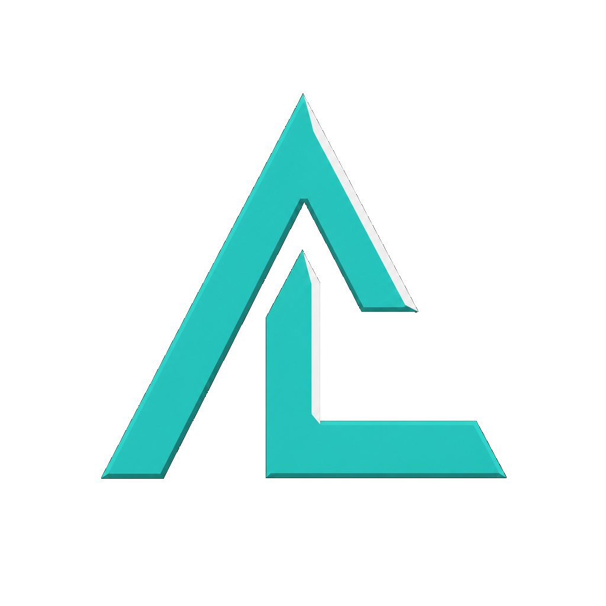
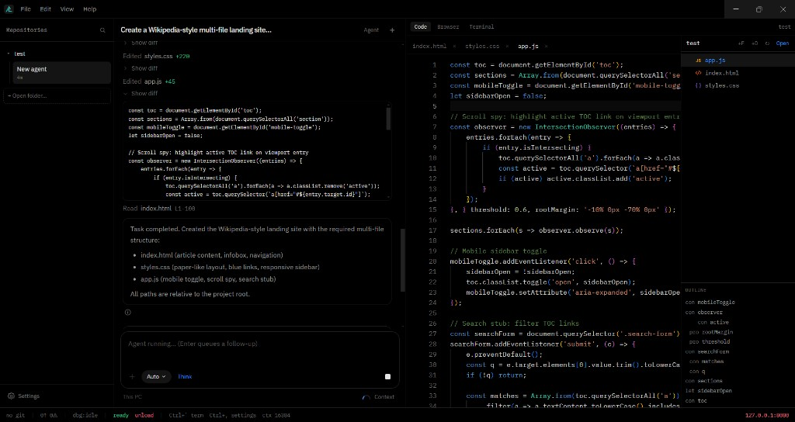
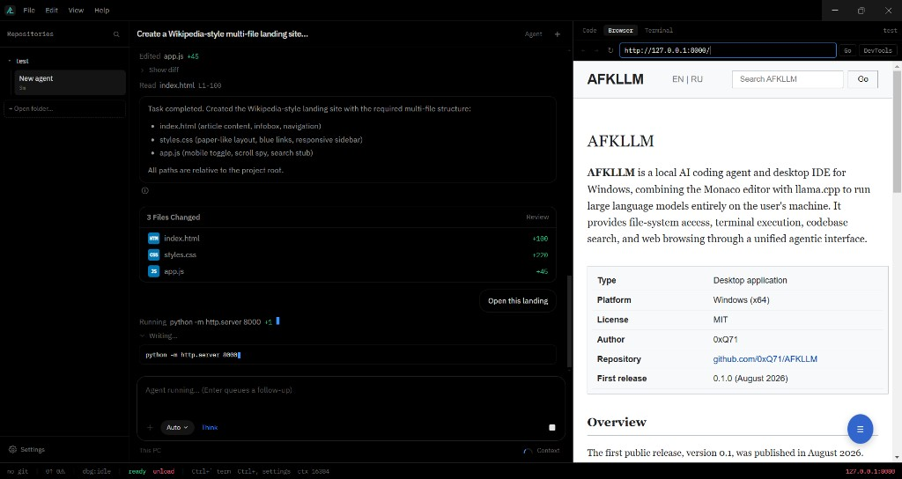
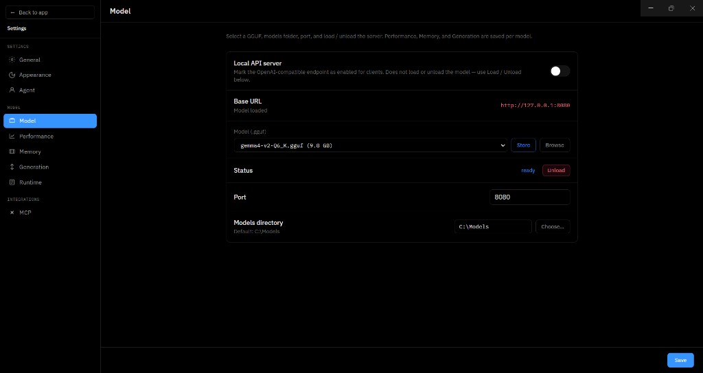
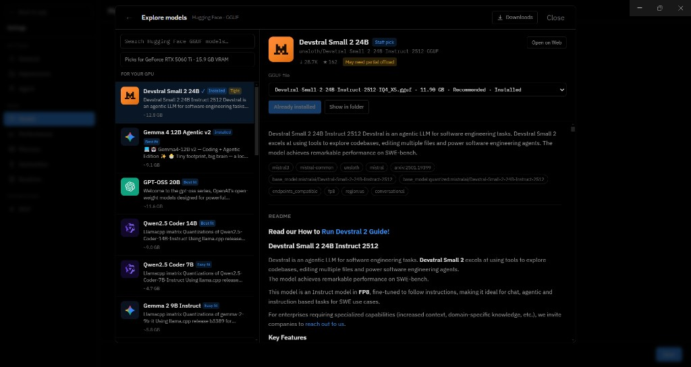

<div align="center">
  <a href="https://github.com/0xQ71/AFKLLM/releases">
    
  </a>
</div>

<p align="center">
  <a href="https://github.com/0xQ71/AFKLLM/releases">Releases</a> |
  <a href="docs/guides/development.md">Development</a> |
  <a href="https://github.com/0xQ71/AFKLLM/issues">Feedback</a>
</p>

<p align="center">
  <a href="https://github.com/0xQ71/AFKLLM/releases"></a>
  <a href="https://github.com/0xQ71/AFKLLM/actions/workflows/ci.yml"></a>
  <a href="https://github.com/0xQ71/AFKLLM/graphs/contributors"></a>
  <a href="LICENSE"></a>
  <a href="https://github.com/0xQ71/AFKLLM/stargazers"></a>
  <a href="https://github.com/0xQ71/AFKLLM/issues"></a>
  <a href="https://github.com/0xQ71/AFKLLM/network/members"></a>
</p>

---

<div align="center">

# AFKLLM

**Local AI coding IDE for Windows** — Electron + Monaco + llama.cpp.

</div>

AFKLLM is an agent-first desktop IDE: chat and tools on the left, editor / browser / terminal on the right. The core loop — chat, file tools, terminal, search, git — runs on your machine with local GGUF models. Optional **vision attach** and **local FLUX image generation** (`sd-cli`) stay on-device too. No cloud account required for everyday coding.

👏 Feedback & bugs → [GitHub Issues](https://github.com/0xQ71/AFKLLM/issues) · docs → [Development](docs/guides/development.md)

❤️ Like AFKLLM? Give it a star 🌟 — it helps others find a local alternative to cloud IDEs.

---

# Screenshot

<p align="center">
  
</p>

<p align="center">
  
</p>

<p align="center">
  
</p>

<p align="center">
  
</p>

---

# Key Features

1. **Local coding agent**

- Local GGUF agent with tools: read / write / patch files, terminal, codebase search, git, web search
- Composer message queue, Think mode, auto-approve, checkpoints / rewind
- MCP (stdio) servers as extra tools (`mcp__…`)
- Context usage gauge, project rules, codebase index / `@codebase`
- Auto-named agent chats from the first prompt
- Soft guards for tool loops and truncated writes; small-file overwrite + fuzzy patches

2. **Editor & IDE shell**

- Monaco with FIM ghost text and Ctrl+K inline edits
- Agent-first layout: repos rail + agent chat left, Code / Browser / Terminal right
- Explorer with file-type icons, multi-repo rails, Outline, Problems
- tsc / eslint diagnostics as squiggles; TypeScript / JavaScript hover, go-to-definition, references
- Agent edits do **not** auto-open every changed file — open from chat chips or the tree
- Built-in browser preview and PTY terminal

3. **Models, vision & image generation**

- Hugging Face store with GPU-aware picks (chat GGUF, vision, FLUX / SD sidecars)
- Thin installer: CPU / CUDA 12 / CUDA / Vulkan packs from [official llama.cpp Releases](https://github.com/ggml-org/llama.cpp/releases)
- First-run onboarding — coding and/or image mode; `.gguf` / diffusion weights are **not** bundled
- Per-model Performance / Memory / Generation profiles; Load / Unload from Settings or status bar
- Optional OpenAI-compatible local API endpoint when enabled
- **Vision attach** (VL GGUF + mmproj): cold-swaps chat↔vision in VRAM, describes the image, restores the coding model
- **File attach** — PDF / DOCX (text + scanned pages via vision), text files, images (drag / paste / picker); photo lightbox in chat
- **`generate_image`** via [stable-diffusion.cpp](https://github.com/leejet/stable-diffusion.cpp) (`sd-cli`): FLUX stack, hires, VAE-on-GPU in `vram` mode, blank-frame guards; composer **Image** mode gated in Settings → Agent
- Paths under **Settings → Model → Multimodal** (vision, mmproj, SD weights, T5 — prefer non-scaled FP8, negative prompt, optional sd-cli path)

4. **Git, updates & app chrome**

- Source Control: stage / unstage / commit, ASCII graph, status-bar branch chip
- Close hides to the tray (confirm while the agent is generating)
- Themes; UI language **RU / EN**
- Update check on launch (notify only); download/install from Settings — `userData` preserved
- Version everywhere: window title, Help → Version, status bar (`v…`), Settings → Updates

5. **Privacy by default**

- Chat, tools, and edits stay on-device for the core loop
- Optional local error log under `userData` — never uploaded by AFKLLM
- Models and llama-server / sd-cli binaries live on your disk

---

# Download

Installers for **Windows x64** are on the [Releases](https://github.com/0xQ71/AFKLLM/releases) page:

| Asset | What it is |
|-------|------------|
| `AFKLLM-*-x64-setup.exe` | NSIS installer (choose install folder, shortcuts, Start Menu) |

AFKLLM is a **thin client**: CUDA / llama-server packs download on first **Load**. Bring your own `.gguf` (or download from the in-app store).

Public installers are intended to be Authenticode-signed via
[SignPath Foundation](https://signpath.org/) (free for open source) once approved —
see [Code signing](docs/guides/code-signing.md). Until then, Windows may show
**Unknown publisher** for unsigned builds.

### After install

1. Open AFKLLM → finish onboarding (coding and/or image mode) or open **Settings → Model**
2. Pick or download a chat GGUF → **Load** (status bar or Settings)
3. Optional: Vision GGUF + mmproj; for Image mode, FLUX sidecars under **Multimodal** / Store
4. **Open folder…** for your project → start an agent chat (composer **Image** / **Фото** when Image mode is on)

### In-app updates

On launch (when online) AFKLLM **only notifies** about a newer GitHub Release — no silent download.  
In **Settings → General → Updates**, click **Update app**, then **Restart to install**. Chats and projects in `userData` are kept.

---

# Roadmap

We're actively working on the following (community feedback welcome via [Issues](https://github.com/0xQ71/AFKLLM/issues)):

1. **Core agent**

- Accept / Reject review for agent file edits (soft-apply before disk)
- Richer `@file` / `@selection` mentions in the composer
- Stronger plan mode and progress checklist across compact / continue

2. **IDE surface**

- Explorer: new / rename / delete polish + Find in files
- Real `<webview>` browser hardening vs iframe preview
- FIM streaming polish and multi-block Ctrl+K

3. **Git & collaboration**

- Remotes: fetch / pull / push + ahead/behind in the status bar
- Diff review UX for agent patches

4. **Platform & packaging**

- Signed Windows releases as the default distribution path
- Docs / i18n polish; more staff-pick GGUF recommendations
- **Android client** (Kotlin): agent workspace (chat, explorer, code, terminal, browser, git, console) + full settings + E2B/E4B GGUF — see [android/README.md](android/README.md)
- Evaluate Linux / macOS later (Windows remains the primary desktop target)

Want to influence the roadmap? Open a [Feature request](https://github.com/0xQ71/AFKLLM/issues/new/choose) or discussion on an existing issue.

---

# Themes

AFKLLM ships UI themes selectable in **Settings → Appearance** (classic and additional built-in themes). Language: English / Russian.

PRs that improve theme contrast, Monaco parity, or accessibility are welcome.

---

# Quick start (development)

```bash
git clone https://github.com/0xQ71/AFKLLM.git
cd AFKLLM
npm install
npm run dev
```

Optional offline backend: put an official llama.cpp Windows build in `./bin/`.

```bash
npm run typecheck
npm run test:smoke
npm run dist          # NSIS setup → ./release/
```

Full stack notes, packaging, and publishing: [Development guide](docs/guides/development.md).

Publishing a release: push tag `v*` (e.g. `v0.1.0-20260807`) → [release workflow](.github/workflows/release.yml), or `npm run dist:publish` locally with `GH_TOKEN`.

---

# Contributing

We welcome contributions to AFKLLM! Here are some ways you can help:

1. **Contribute code** — features, performance, Electron / agent / Monaco fixes
2. **Fix bugs** — reproduce, isolate, and send a focused PR
3. **Maintain issues** — triage, reproduce, label, write clear repro steps
4. **Product design** — UX feedback on agent / settings / store flows
5. **Write documentation** — README, guides, release notes, i18n (EN / RU)
6. **Promote usage** — stars, shares, fair comparisons with other local tools

See [CONTRIBUTING.md](CONTRIBUTING.md) for details.

## Getting Started

1. **Fork** the repository and clone your fork
2. **Create a branch** for your change
3. Run `npm run typecheck` (and `npm run test:smoke` when touching agent / git / LSP / runtime / MCP)
4. **Open a Pull Request** — what / why / how you tested

Thank you for your support and contributions!

---

# Related projects

- [llama.cpp](https://github.com/ggml-org/llama.cpp) — local inference (`llama-server`) behind AFKLLM
- [Monaco Editor](https://github.com/microsoft/monaco-editor) — the in-app code editor
- [Electron](https://github.com/electron/electron) — desktop shell
- [Model Context Protocol](https://modelcontextprotocol.io/) — optional MCP tool servers

---

# Contributors

<a href="https://github.com/0xQ71/AFKLLM/graphs/contributors">
  
</a>

---

# GitHub Stats


---

# Star History

<a href="https://www.star-history.com/#0xQ71/AFKLLM&Date">
  <picture>
    <source media="(prefers-color-scheme: dark)" srcset="https://api.star-history.com/svg?repos=0xQ71/AFKLLM&type=Date&theme=dark" />
    <source media="(prefers-color-scheme: light)" srcset="https://api.star-history.com/svg?repos=0xQ71/AFKLLM&type=Date" />
    
  </picture>
</a>

---

# License

AFKLLM is released under the **MIT License** — see [LICENSE](LICENSE).

- Attribution: [NOTICE](NOTICE)
- Third-party notices for bundled dependencies: [THIRD_PARTY_NOTICES.md](THIRD_PARTY_NOTICES.md)  
  (regenerate with `npm run licenses:third-party` after dependency changes)

Copyright © 2026 [0xQ71](https://github.com/0xQ71).
